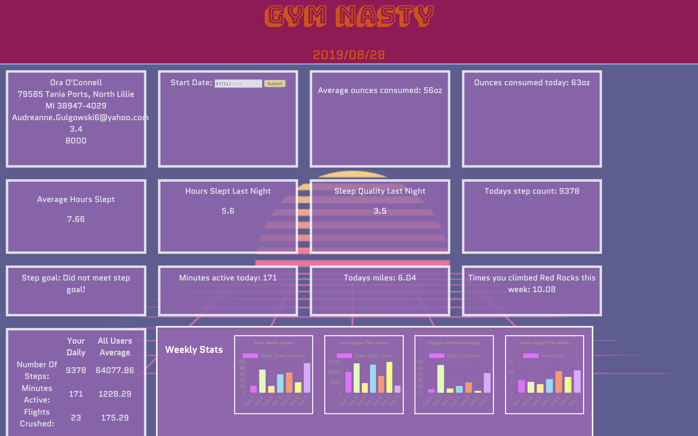

# FitLit Starter Kit: Overview

Fitlit is an application used to track your habits in multiple areas of overall health. There are capabilities for tracking your hydration, a user can track their average ounces consumed vs their ounces consumed for the current day. A user can also track their activity levels. Things like step count, minutes active, and stairs climbed are all displayed for the user. The user will also have the ability choose a date range or individual day and view their data from that date. 

## Technical Overview

This application uses a combination of different technologies
  - HTML
  - CSS
  - Javascript
  - jQuery
  - Moca/chai 

## Wins

Setting up the class structure was a challenege with this application. We spent a solid amount of time planning the structure out before actually putting our hands on the keys. We were able to come up with a structure that allowed us to shrink the data for testing and then implement with our larger data sets. 

## Challenges

Setting up the date range was a challenege, understanding how to transfer that data to new charts and tracked activity boxs. This would be a good area for further development.  

## Desktop Screenshot:

